# Чтобы настроить среду разработки на mac os Mojave тебе нужно выполнить пару шагов

## Пожалуйста прочти инструкцию от начала до конца. Если что-то кажется тебе сложным, отложи настройку или пройди по шагам виртуально не внося изменений, а когда будешь готов повтори шаг за шагом.

[Скачать и установить IDE PhpStorm](https://www.jetbrains.com/phpstorm/)

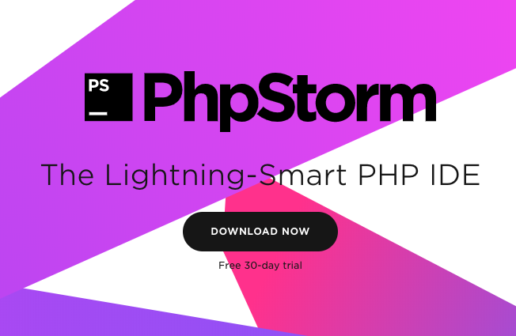

---

Открыть терминал. (Mac > Aplications(Программы, если у тебя русский интерфейс) > Utilites(Утилиты)

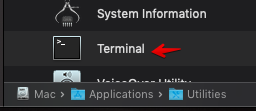

---

### Откроется такое окно:

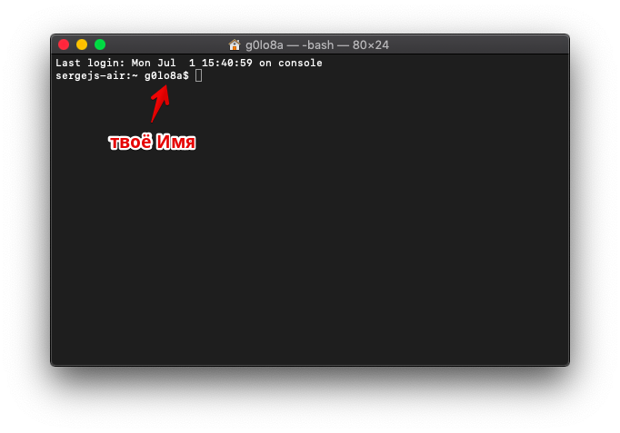

---

После знака $ скопируй и вставь следующую команду:

sudo nano /private/etc/apache2/httpd.conf

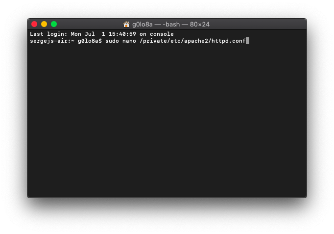

---

и нажми клавишу «ввод»

Теперь нужно ввести пароль и нажать клавишу «ввод»

(во время ввода пароля в терминале ничего не происходит. Не обращай внимания. Это заморочки безопасности)

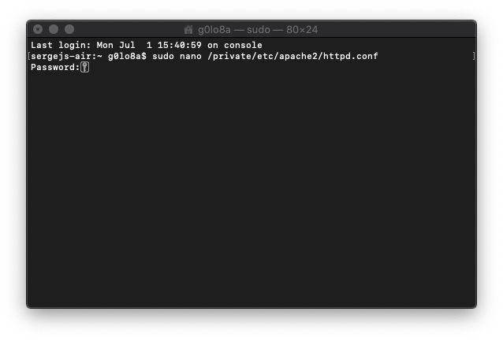

---

Откроется файл httpd.conf

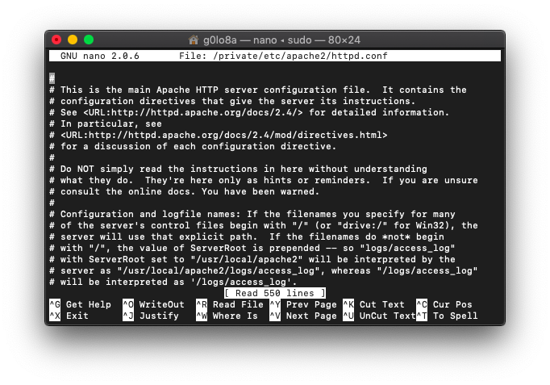

---

Нужно найти строку: # LoadModule php7_module libexec/apache2/libphp7.so

Сделать это можно зажав клавиши «ctrl» и «W», вставить строку и нажать клавишу «ввод»

раскомментируй её удалив символ «#» из начала строки.

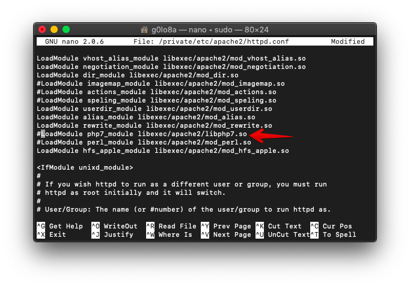

---

Далее зажимаешь клавиши «ctrl» и «Х», 

подтверждаешь выход с сохранением измениений нажатием клавиши «Y» следом нажать клавишу «ввод»

Хорошо. Давай проверим как всё работает. Создай папку в удобном для тебя месте.

Запусти PhpStorm и открой созданную папку

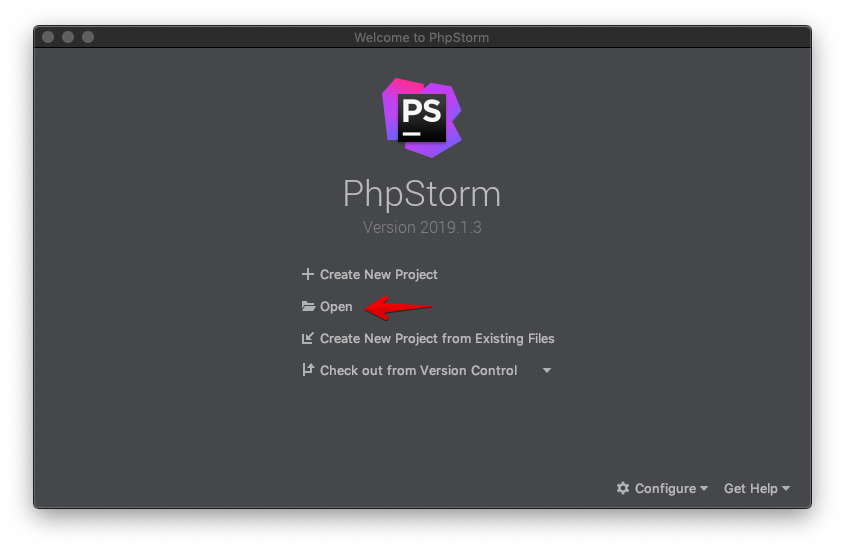

---

далее правый клик по папке - создать новый PHP файл. Назовём его index.php

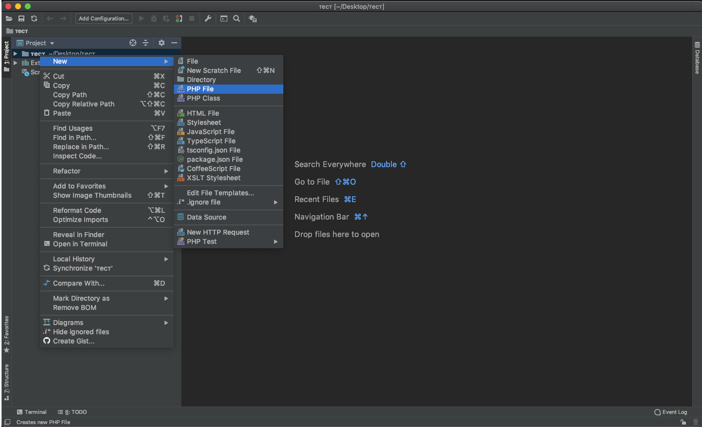

---

Далее настройки

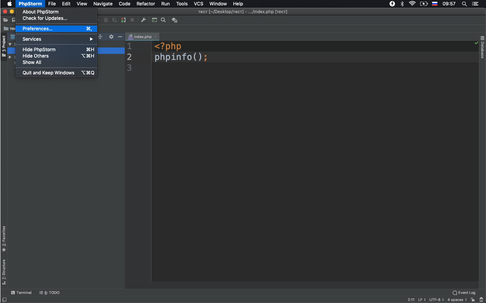

---

Сделай всё как на скриншоте:

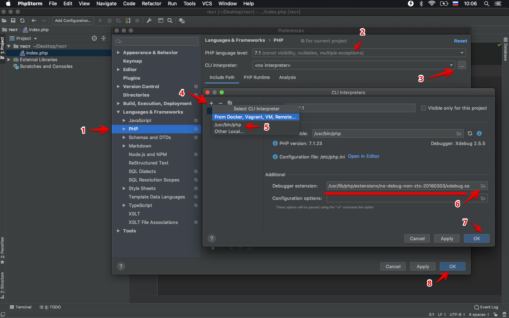

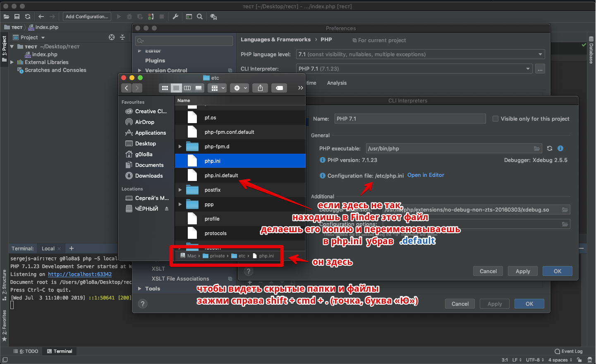

---

Открой встроенный терминал

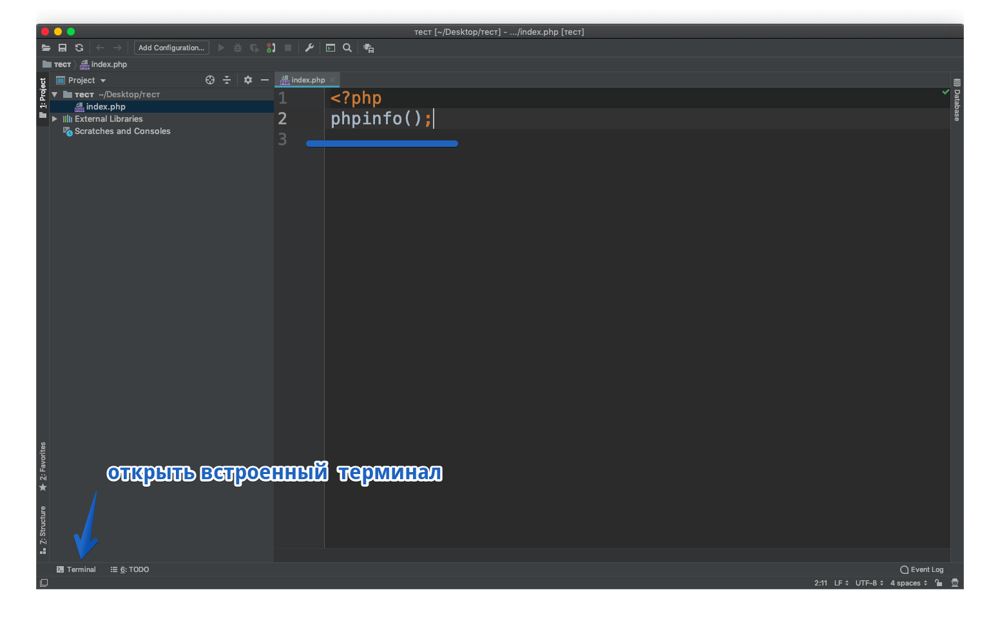

---

Набери: php -S localhost:63342 и нажми клавишу «ввод»

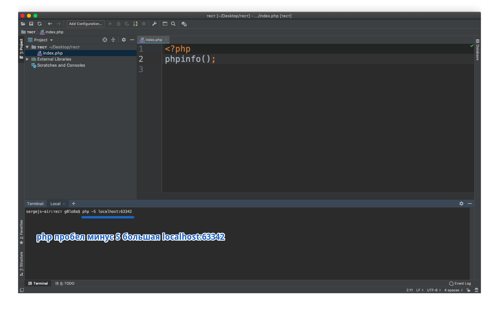

---

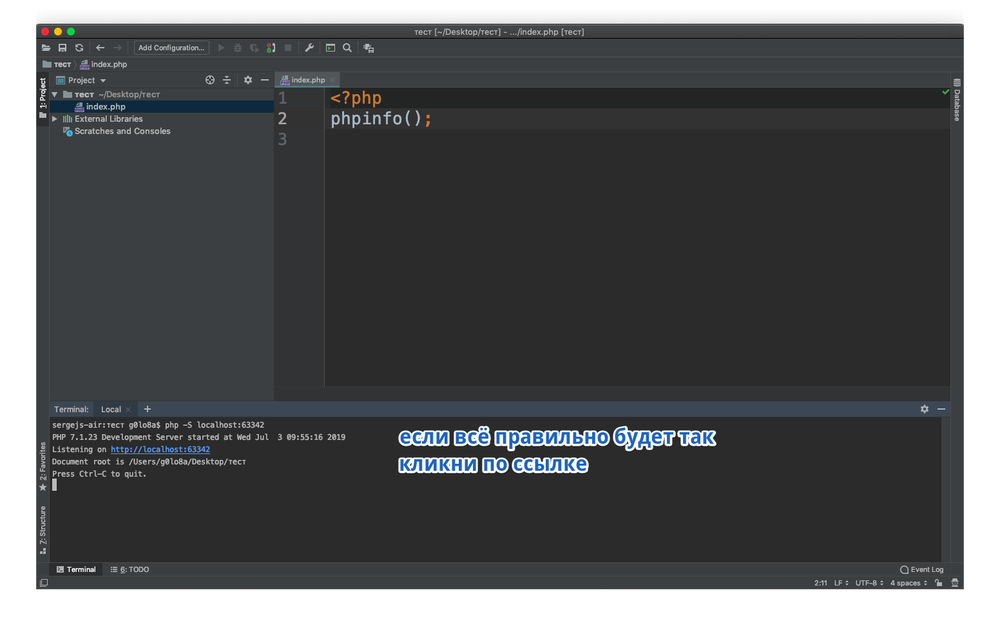

---

Если ты увидел это - то всё правильно сделал

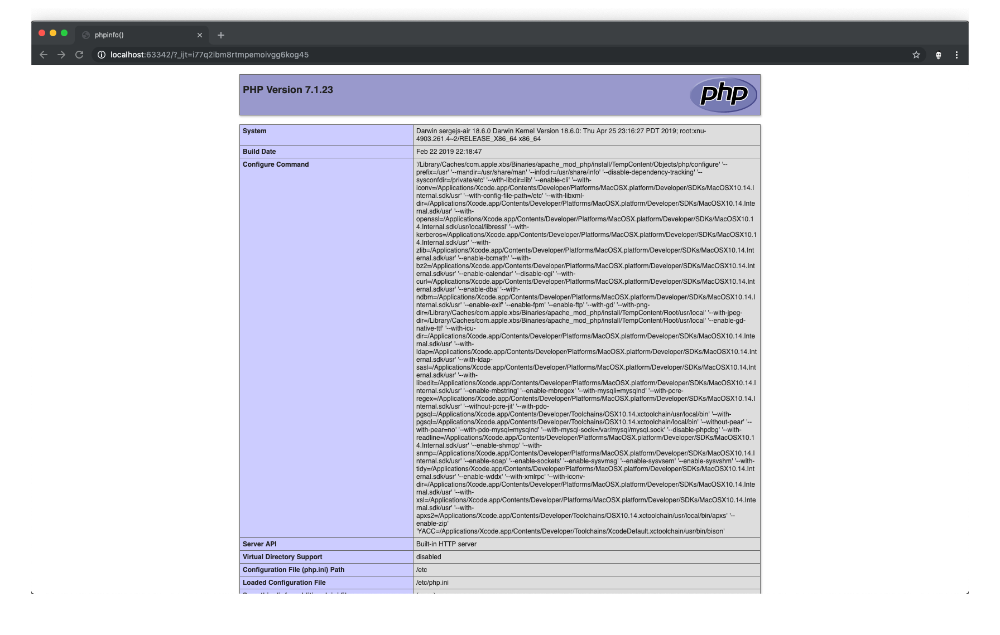

Внеси изменения в файле

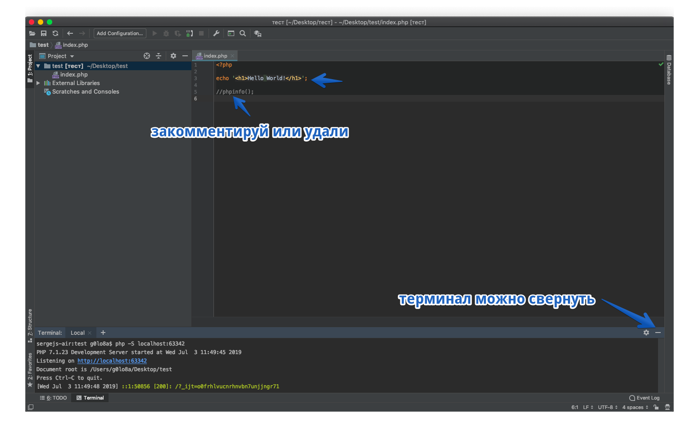

Обнови браузер

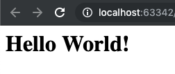

# Готово! поздравляю!

Далее Git. Система контроля версий так же встроена в PhpStorm.

Давай я тебе всё покажу.

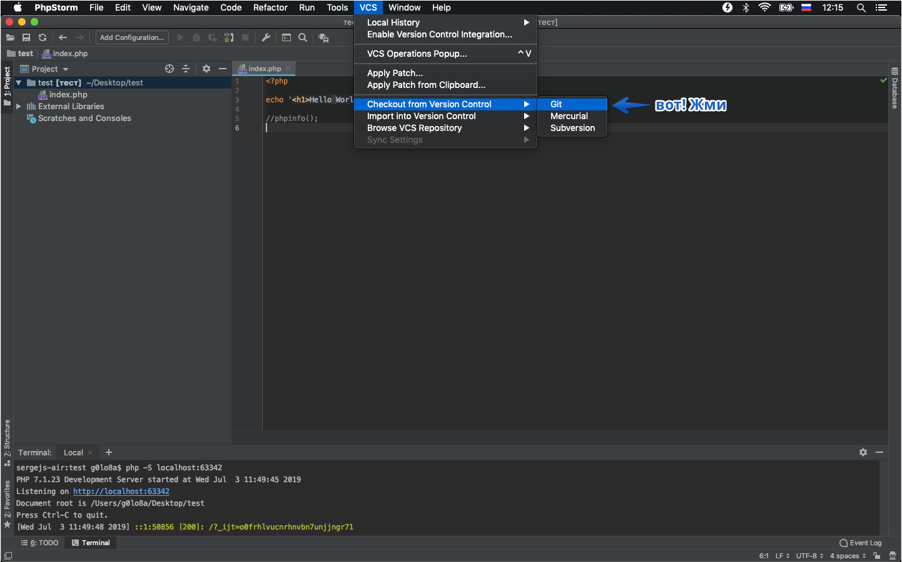

Клонирование репозитория. Залогинься, вставь ссылку на репозиторий, укажи путь до папки(она может лежать в где угодно, главное должна быть пустой)

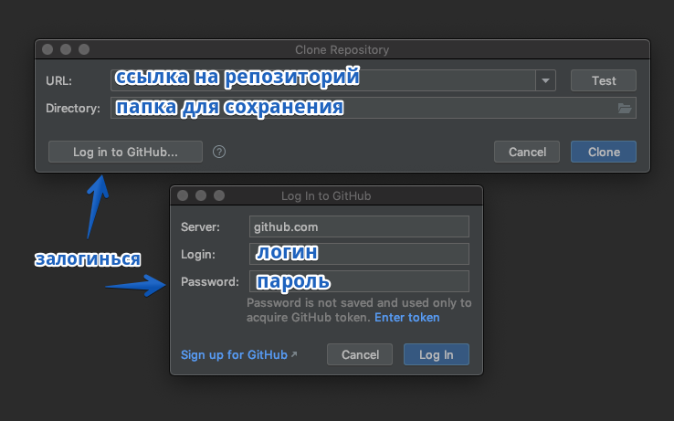

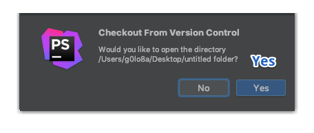

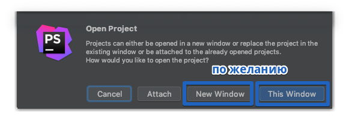

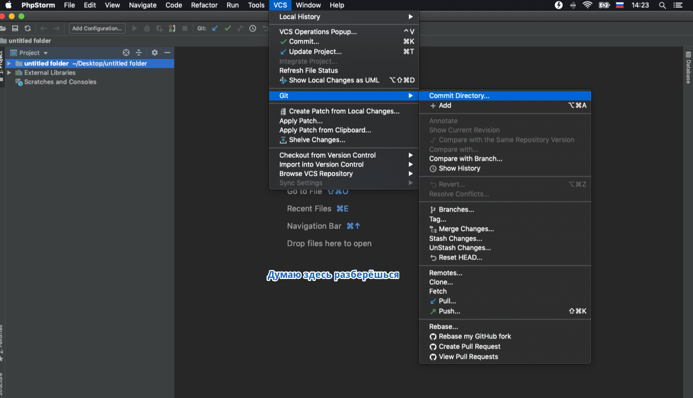

---

[Про синхронизацию с удаленным сервером посмотри на YouTube](https://www.youtube.com/watch?v=ZKH7kIRyURY&list=PLY4rE9dstrJzAnXFt9m48Q0V5_2kVK1Qt)

[И ещё видео](https://www.youtube.com/watch?v=23VkWSKZ_lM&list=LL6qZ8UhL1_nPfu5C16YXlvA&index=2&t=0s)
