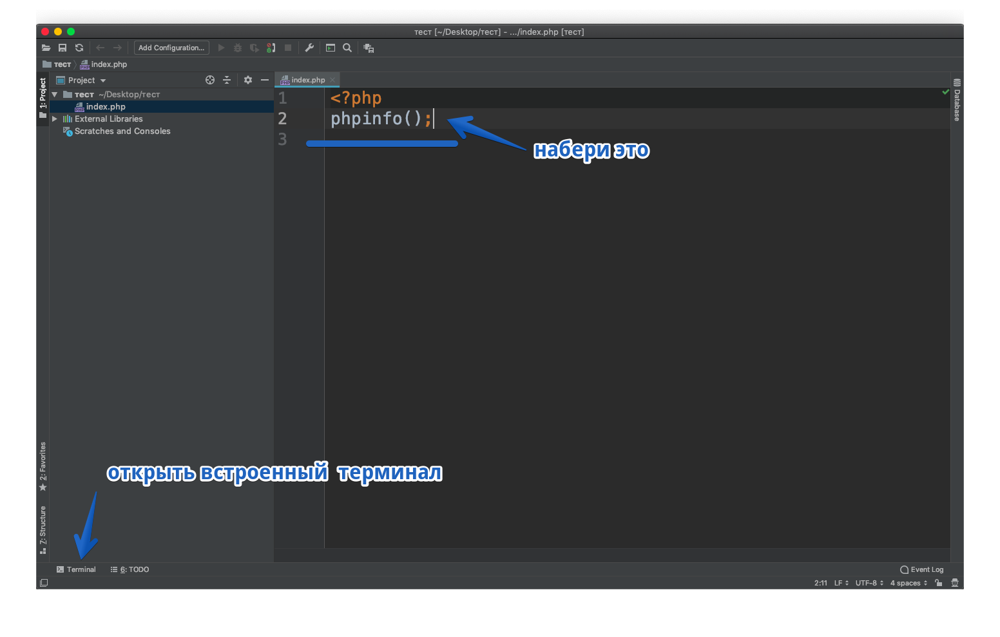
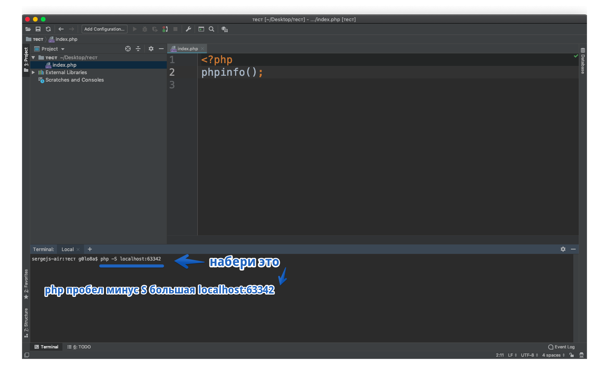

# Чтобы настроить среду разработки на mac os Mojave тебе нужно выполнить пару шагов
[Скачать и установить IDE PhpStorm](https://www.jetbrains.com/phpstorm/)

Открыть терминал. (Mac > Aplications(Программы, если у тебя русский интерфейс) > Utilites(Утилиты)

### Откроется такое окно:

После знака $ скопируй и вставь следующую команду:
sudo nano /private/etc/apache2/httpd.conf

и нажми клавишу «ввод»
Теперь нужно ввести пароль и нажать клавишу «ввод»
(во время ввода пароля в терминале ничего не происходит. Не обращай внимания. Это заморочки безопасности)

Откроется файл httpd.conf

Нужно найти строку: # LoadModule php7_module libexec/apache2/libphp7.so
Сделать это можно зажав клавиши «ctrl» и «W», вставить строку и нажать клавишу «ввод»
раскомментируй её удалив символ «#» из начала строки.

Далее зажимаешь клавиши «ctrl» и «Х», подтверждаешь выход с сохранением измениений нажатием клавиши «Y» следом
нажать клавишу «ввод»
Хорошо. Давай проверим как всё работает. Создай папку в удобном для тебя месте.
Запусти PhpStorm и открой созданную папку

далее правый клик по папке - создать новый PHP файл. Назовём его index.php

Далее настройки

Открой встроенный терминал

Набери команду php -S localhost:63342 
и нажми клавишу «ввод»

